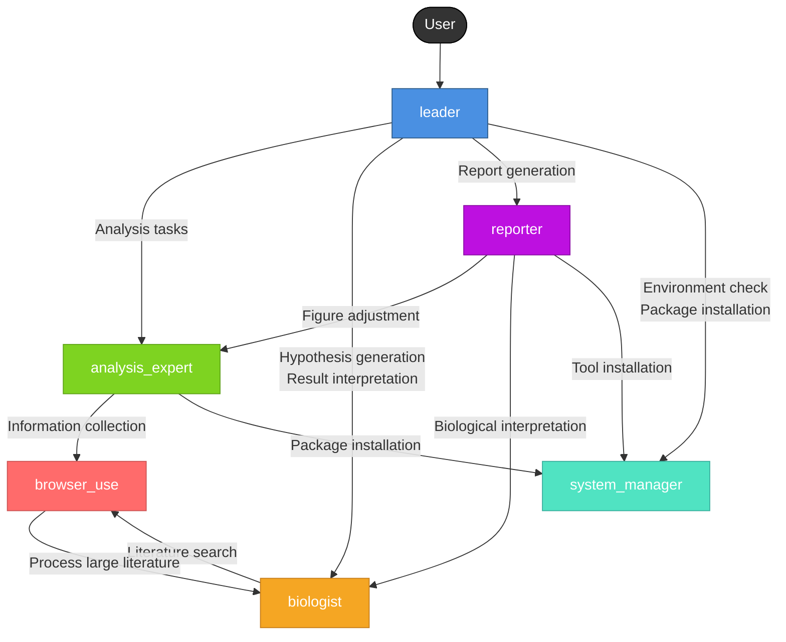

# Single Cell Analysis Team

A specialized AI team for autonomous exploratory analysis of single-cell and spatial omics data (e.g., scRNA-seq, MERFISH, Visium).

## Team Structure

| Agent | Role | Key Capabilities |
|-------|------|------------------|
| **leader** | Orchestrator | Task delegation, workflow management, workdir organization |
| **analysis_expert** | Data Analyst | Python/notebook analysis, visualization, skills system |
| **biologist** | Domain Expert | Hypothesis generation, biological interpretation |
| **reporter** | Report Writer | LaTeX/PDF report generation, figure organization |
| **system_manager** | DevOps | Environment investigation, package installation |
| **browser_use** | Researcher | Web search, literature collection, reference management |

## Core Workflow

1. **Environment Understanding**: Check computational environment, record in `environment.md`
2. **Dataset Analysis**: Delegate to `analysis_expert` for data understanding and QC
3. **Hypothesis Generation**: Delegate to `biologist` for generating research directions
4. **Planning**: Create `todolist.md` with analysis plan
5. **Execution Loop**: Iteratively run analysis → biological interpretation
6. **Reporting**: Delegate to `reporter` for publication-quality PDF report

## Work Intensity Levels

| Level | Keyword | Analysis Loops |
|-------|---------|----------------|
| Low | "basic" | 1 loop |
| Medium | (default) | 3 loops |
| High | "deep", "hard" | ≥5 loops |

## Skills System

Agents can access domain-specific best practices from `analysis-skills/SKILL.md`.

## Agent Call Relationships

The following diagrams show how agents can call each other within the team.

### Text-Based Call Graph

```
                                    [User]
                                      │
                                      ▼
                              ┌─────────────┐
                              │   leader    │ (Orchestrator)
                              └─────────────┘
                    ┌──────────────┼──────────────┬──────────────┐
                    │              │              │              │
                    ▼              ▼              ▼              ▼
          ┌─────────────────┐  ┌──────────┐  ┌──────────┐  ┌────────────────┐
          │ analysis_expert │  │biologist │  │ reporter │  │ system_manager │
          └─────────────────┘  └──────────┘  └──────────┘  └────────────────┘
                │     │             │              │   │              ▲
                │     │             │              │   │              │
                │     │             │              │   └──────────────┤
                │     │             │              │                  │
                │     │             │              └──────────┐       │
                │     │             │                         │       │
                │     │             └─────────┐               │       │
                │     │                       │               │       │
                │     └───────────┐           │               │       │
                │                 ▼           ▼               ▼       │
                │           ┌──────────────────────────┐              │
                │           │     browser_use          │              │
                │           └──────────────────────────┘              │
                │                       │                             │
                │                       └─────────────────────────────┘
                │                    (Process large literature)
                │
                └─────────────────────────────────────────────────────┘
                              (Package installation)

Legend:
  → : Can call / delegate to
  
Call Patterns:
  • leader          → analysis_expert, biologist, reporter, system_manager
  • analysis_expert → browser_use, system_manager
  • biologist       → browser_use
  • reporter        → analysis_expert, biologist, system_manager
  • browser_use     → biologist (for literature analysis)
  • system_manager  → (none - leaf node)
```

### Interactive Mermaid Diagram

The following diagram shows how agents can call each other within the team:



### Call Relationship Summary

| Caller Agent | Can Call | Purpose |
|--------------|----------|---------|
| **leader** | `analysis_expert`, `biologist`, `reporter`, `system_manager` | Orchestrate entire workflow |
| **analysis_expert** | `browser_use`, `system_manager` | Get information, install packages |
| **biologist** | `browser_use` | Search literature and databases |
| **reporter** | `analysis_expert`, `biologist`, `system_manager` | Adjust figures, get interpretations, install tools |
| **browser_use** | `biologist` | Delegate large literature analysis |
| **system_manager** | _(none)_ | Leaf node - provides services only |
